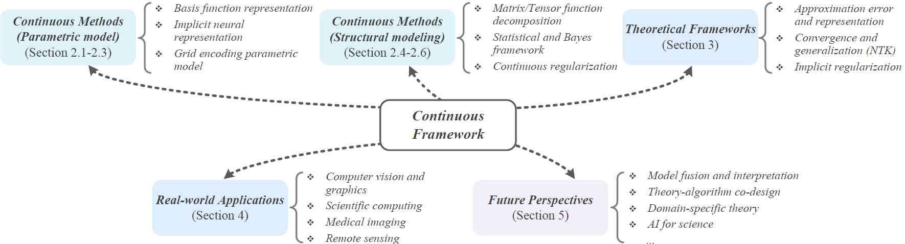
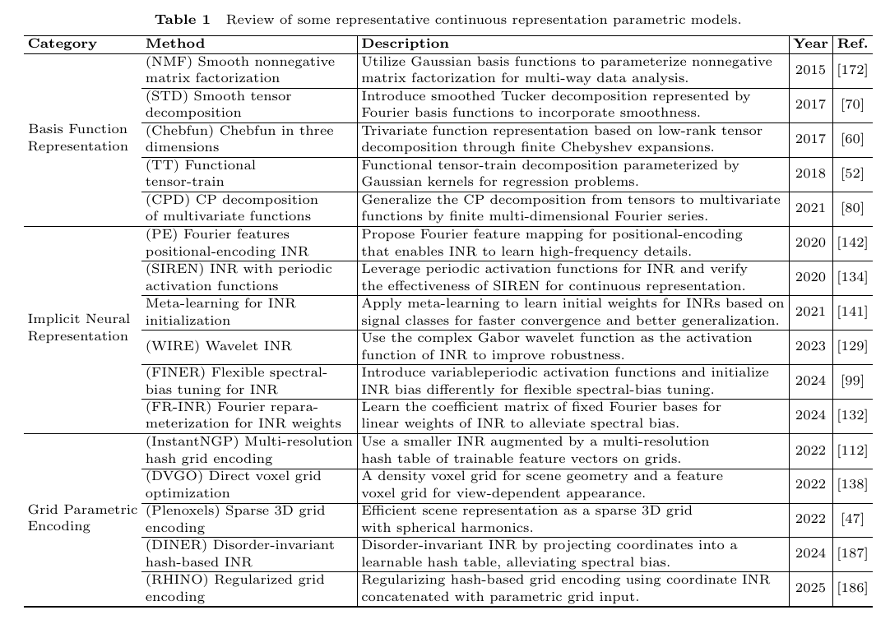
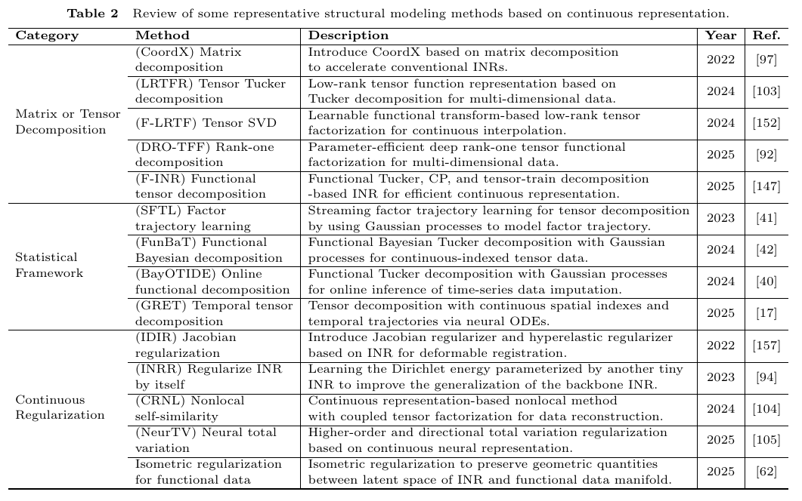
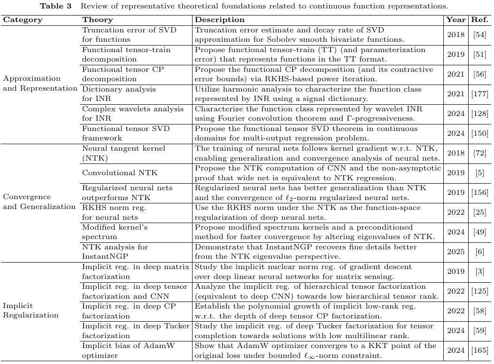
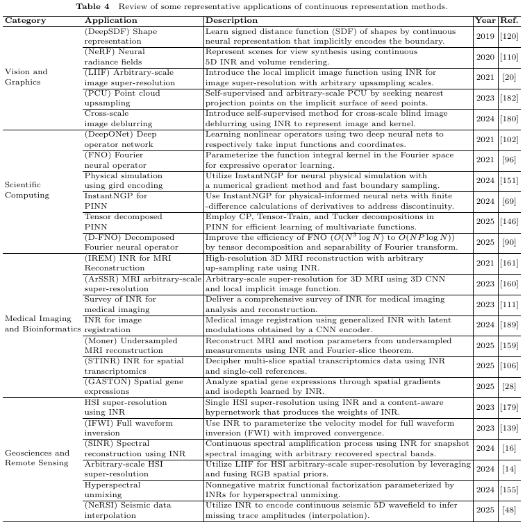

# Continuous-Representation-Zoo

This project summarizes the papers and studies introduced in the review: Continuous Representation Methods, Theories, and Applications: An Overview and Perspectives 📖

# Abstract ✨

Recently, continuous representation methods emerge as novel paradigms that characterize the intrinsic structures of real-world data through function representations that map positional coordinates to their corresponding values in the continuous space. As compared with the traditional discrete framework, the continuous framework demonstrates inherent superiority for data representation and reconstruction (e.g., image restoration, novel view synthesis, and waveform inversion) by offering inherent advantages including resolution flexibility, cross-modal adaptability, inherent smoothness, and parameter efficiency. In this review, we systematically examine recent advancements in continuous representation frameworks, focusing on three aspects: (i) Continuous representation method designs such as basis function representation, statistical modeling, tensor function decomposition, and implicit neural representation; (ii) Theoretical foundations of continuous representations such as approximation error analysis, convergence property, and implicit regularization; (iii) Real-world applications of continuous representations derived from computer vision, graphics, bioinformatics, and remote sensing. Furthermore, we outline future directions and perspectives to inspire exploration and deepen insights to facilitate continuous representation methods, theories, and applications.

    

    bibtex:
    @article{arXiv2025Luo,
     author  = {Yisi Luo, Xile Zhao, Deyu Meng},
     title   = {Continuous Representation Methods, Theories, and Applications: An Overview and Perspectives},
     journal = {arXiv:},
     year    = {2025},
    }

# Continuous Methods (Parametric model)

## Basis Function Representation

- Tatsuya Yokota, Rafal Zdunek, Andrzej Cichocki, and Yukihiko Yamashita. Smooth nonnegative matrix and tensor factorizations for robust multi-way data analysis. Signal Processing, 2015. [<a href="https://www.sciencedirect.com/science/article/pii/S0165168415000614">paper</a>]

## Implicit Neural Representation

## Grid Encoding Parametric Model

    

# Continuous Methods (Structural modeling)

    

# Theoretical Foundations

    

# Applications

    

