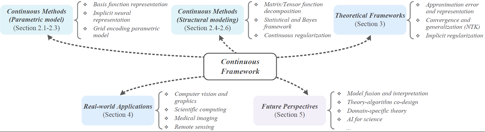

# Continuous-Representation-Zoo
This project summarizes the papers and studies introduced in the review: Continuous Representation Methods, Theories, and Applications: An Overview and Perspectives 📖

# Abstract ✨
Recently, continuous representation methods emerge as novel paradigms that characterize the intrinsic structures of real-world data through function representations that map positional coordinates to their corresponding values in the continuous space. As compared with the traditional discrete framework, the continuous framework demonstrates inherent superiority for data representation and reconstruction (e.g., image restoration, novel view synthesis, and waveform inversion) by offering inherent advantages including resolution flexibility, cross-modal adaptability, inherent smoothness, and parameter efficiency. In this review, we systematically examine recent advancements in continuous representation frameworks, focusing on three aspects: (i) Continuous representation method designs such as basis function representation, statistical modeling, tensor function decomposition, and implicit neural representation; (ii) Theoretical foundations of continuous representations such as approximation error analysis, convergence property, and implicit regularization; (iii) Real-world applications of continuous representations derived from computer vision, graphics, bioinformatics, and remote sensing. Furthermore, we outline future directions and perspectives to inspire exploration and deepen insights to facilitate continuous representation methods, theories, and applications.

    

# Continuous Methods (Parametric model)

    

INR
## Our MLLM works

🔥🔥🔥 **A Survey on Multimodal Large Language Models**  
**[Project Page [This Page]](https://github.com/BradyFU/Awesome-Multimodal-Large-Language-Models)** | **[Paper](https://arxiv.org/pdf/2306.13549.pdf)** | :black_nib: **[Citation](./images/bib_survey.txt)** | **[💬 WeChat (MLLM微信交流群，欢迎加入)](./images/wechat-group.png)**

The first comprehensive survey for Multimodal Large Language Models (MLLMs). :sparkles:  

---

🔥🔥🔥 **VITA: Towards Open-Source Interactive Omni Multimodal LLM**  

    

 [[📽 VITA-1.5 Demo Show! Here We Go! 🔥](https://youtu.be/tyi6SVFT5mM?si=fkMQCrwa5fVnmEe7)] 
  

 [[📖 VITA-1.5 Paper](https://arxiv.org/pdf/2501.01957)] [[🌟 GitHub](https://github.com/VITA-MLLM/VITA)] [[🤖 Basic Demo](https://modelscope.cn/studios/modelscope/VITA1.5_demo)] [[🍎 VITA-1.0](https://vita-home.github.io/)] [[💬 WeChat (微信)](https://github.com/VITA-MLLM/VITA/blob/main/asset/wechat-group.jpg)]
  

 We are excited to introduce the **VITA-1.5**, a more powerful and more real-time version. ✨ 

**All codes of VITA-1.5 have been released**! :star2: 
  

You can experience our [Basic Demo](https://modelscope.cn/studios/modelscope/VITA1.5_demo) on ModelScope directly. The Real-Time Interactive Demo needs to be configured according to the [instructions](https://github.com/VITA-MLLM/VITA?tab=readme-ov-file#-real-time-interactive-demo).

---

🔥🔥🔥 **Long-VITA: Scaling Large Multi-modal Models to 1 Million Tokens with Leading Short-Context Accuracy**  

    

 [[📖 arXiv Paper](https://arxiv.org/pdf/2502.05177)] [[🌟 GitHub](https://github.com/VITA-MLLM/Long-VITA)]
  

 Process more than **4K frames** or over **1M visual tokens**. State-of-the-art on Video-MME under 20B models!  ✨ 

---

🔥🔥🔥 **MM-RLHF: The Next Step Forward in Multimodal LLM Alignment**  

    

 [[📖 arXiv Paper](https://arxiv.org/pdf/2502.10391)] [[🌟 GitHub](https://github.com/Kwai-YuanQi/MM-RLHF)] [[📊 MM-RLHF Data](https://huggingface.co/datasets/yifanzhang114/MM-RLHF)] 
  

Align MLLMs with human preference, including a high-quality dataset, a strong reward model, a new alignmen algorithm, and two new benchmarks.✨

---

🔥🔥🔥 **MME-Survey: A Comprehensive Survey on Evaluation of Multimodal LLMs**  

    

 [[🍎 Project Page](https://github.com/BradyFU/Awesome-Multimodal-Large-Language-Models/tree/Benchmarks)] [[📖 arXiv Paper](https://arxiv.org/pdf/2411.15296)] 

 Jointly introduced by **MME**, **MMBench**, and **LLaVA** teams. ✨ 

---

🔥🔥🔥 **Video-MME: The First-Ever Comprehensive Evaluation Benchmark of Multi-modal LLMs in Video Analysis**  
**[Project Page](https://video-mme.github.io/)** | **[Paper](https://arxiv.org/pdf/2405.21075)** | **[GitHub](https://github.com/BradyFU/Video-MME)** | **[Dataset](https://github.com/BradyFU/Video-MME?tab=readme-ov-file#-dataset)** | **[Leaderboard](https://video-mme.github.io/home_page.html#leaderboard)**

We are very proud to launch Video-MME, the first-ever comprehensive evaluation benchmark of MLLMs in Video Analysis! 🌟  

It includes short- (< 2min), medium- (4min\~15min), and long-term (30min\~60min) videos, ranging from <b>11 seconds to 1 hour</b>. All data are newly collected and annotated by humans, not from any existing video dataset. ✨ 

---

🔥🔥🔥 **MME: A Comprehensive Evaluation Benchmark for Multimodal Large Language Models**  
**[Paper](https://arxiv.org/pdf/2306.13394.pdf)** | **[Download](https://huggingface.co/datasets/darkyarding/MME/blob/main/MME_Benchmark_release_version.zip)** | **[Eval Tool](https://github.com/BradyFU/Awesome-Multimodal-Large-Language-Models/blob/Evaluation/tools/eval_tool.zip)** | :black_nib: **[Citation](./images/bib_mme.txt)**

A representative evaluation benchmark for MLLMs. :sparkles:  

---

🔥🔥🔥 **Woodpecker: Hallucination Correction for Multimodal Large Language Models**  
**[Paper](https://arxiv.org/pdf/2310.16045)** | **[GitHub](https://github.com/BradyFU/Woodpecker)**

This is the first work to correct hallucination in multimodal large language models. :sparkles:  

